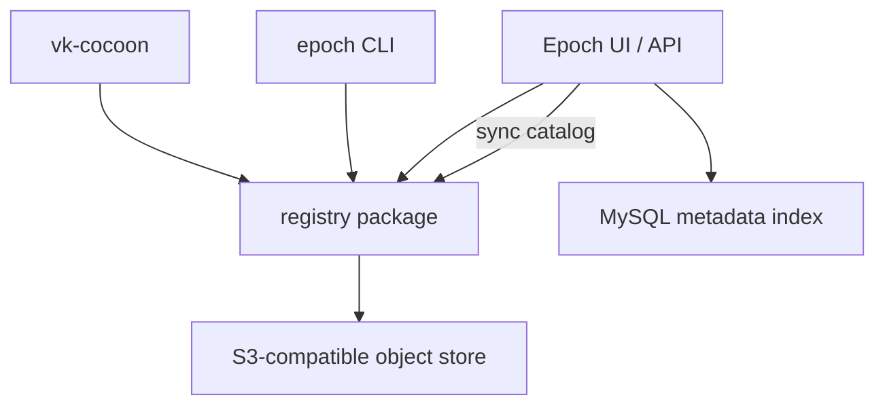

# Epoch

Epoch is a snapshot registry for Cocoon-managed MicroVMs. It stores manifests and blobs in an S3-compatible object store, exposes an OCI-style `/v2/` API for automation, and provides a small web UI for browsing repositories and managing registry tokens.

This public version is intentionally scoped to the orchestration layer. It does not assume any agent framework, internal object storage, or internal identity provider.

## What It Does

- Stores Cocoon snapshots as content-addressed blobs plus versioned manifests
- Serves a Docker/OCI-shaped read and write API under `/v2/`
- Keeps queryable metadata in MySQL for the web UI and control API
- Supports optional browser login with Google OAuth or any OIDC provider
- Lets `vk-cocoon` pull snapshots on demand before creating VMs

## Architecture



## Quick Start

Start local dependencies:

```bash
cd deploy
export MYSQL_ROOT_PASSWORD=<set-me>
export MYSQL_PASSWORD=<set-me>
export MINIO_ROOT_USER=<set-me>
export MINIO_ROOT_PASSWORD=<set-me>
docker compose up -d
```

Build and run Epoch:

```bash
export EPOCH_S3_ENDPOINT=http://127.0.0.1:9000
export EPOCH_S3_ACCESS_KEY=<set-me>
export EPOCH_S3_SECRET_KEY=<set-me>
export EPOCH_S3_BUCKET=epoch
export EPOCH_S3_SECURE=false

go run . serve --addr=:4300 --dsn='epoch:epoch@tcp(127.0.0.1:3306)/epoch?parseTime=true'
```

Push and inspect a snapshot:

```bash
epoch push ubuntu-dev --tag latest
epoch ls
epoch inspect ubuntu-dev:latest
```

## Object Storage Configuration

Epoch uses these environment variables:

| Variable | Description |
|---|---|
| `EPOCH_S3_ENDPOINT` | S3 endpoint, with or without scheme |
| `EPOCH_S3_ACCESS_KEY` | Access key |
| `EPOCH_S3_SECRET_KEY` | Secret key |
| `EPOCH_S3_BUCKET` | Bucket name |
| `EPOCH_S3_REGION` | Optional region |
| `EPOCH_S3_SECURE` | `true` or `false`; inferred from endpoint scheme if omitted |
| `EPOCH_S3_PREFIX` | Optional key prefix, defaults to `epoch/` |
| `EPOCH_S3_ENV_FILE` | Optional env file path, defaults to `~/.config/epoch/s3.env` |

The same keys can be read from a Kubernetes ConfigMap when `vk-cocoon` uses `registry.NewPuller(...)`.

Object layout:

```text
epoch/
├── catalog.json
├── manifests/
│   └── <repo>/<tag>.json
└── blobs/
    └── sha256/<digest>
```

## Authentication

Epoch has two auth planes.

Registry clients:

- `/v2/` accepts bearer tokens
- bootstrap token comes from `EPOCH_REGISTRY_TOKEN`
- UI-created tokens are stored in MySQL and validated by hash

Web UI and control API:

- disabled by default
- when enabled, browser routes use session cookies
- supports Google OAuth or generic OIDC

### Google OAuth

```bash
export SSO_PROVIDER=google
export GOOGLE_OAUTH_CLIENT_ID=...
export GOOGLE_OAUTH_CLIENT_SECRET=...
export GOOGLE_OAUTH_REDIRECT_URI=https://epoch.example.com/login/callback
export GOOGLE_OAUTH_HOSTED_DOMAIN=example.com   # optional
export SSO_COOKIE_SECRET=<32-byte-hex>
```

### Generic OIDC

```bash
export SSO_PROVIDER=oidc
export SSO_CLIENT_ID=...
export SSO_CLIENT_SECRET=...
export SSO_REDIRECT_URI=https://epoch.example.com/login/callback
export SSO_AUTHORIZE_URL=https://issuer.example.com/oauth2/authorize
export SSO_TOKEN_URL=https://issuer.example.com/oauth2/token
export SSO_USERINFO_URL=https://issuer.example.com/oauth2/userinfo
export SSO_LOGOUT_URL=https://issuer.example.com/logout   # optional
export SSO_SCOPES="openid profile email"
export SSO_COOKIE_SECRET=<32-byte-hex>
```

Leave `SSO_PROVIDER` unset to keep the UI open without login.

## Deployment

- [deploy/docker-compose.yaml](./deploy/docker-compose.yaml): local MySQL + MinIO
- [deploy/epoch-server.yaml](./deploy/epoch-server.yaml): Kubernetes Deployment template
- [deploy/Dockerfile](./deploy/Dockerfile): container image build

## Integration with vk-cocoon

`vk-cocoon` can treat snapshot references as remote registry entries and pull them to `/data01/cocoon` before VM creation. The intended flow is:

1. workload references a snapshot name or Epoch URL
2. `vk-cocoon` calls `EnsureSnapshot(...)`
3. Epoch downloads missing data from object storage
4. Cocoon clones or runs the VM locally

## License

MIT
